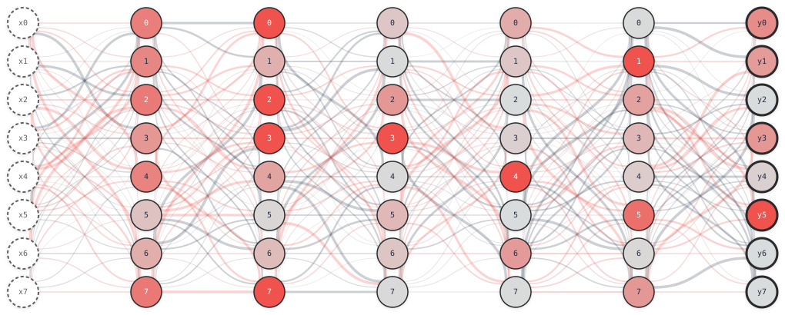

<div align="center">
  
</div>

# ARC WhiteBox Estimation Challenge 2026 - Starter Kit

<div align="center">

<a href="https://www.aicrowd.com/challenges/arc-white-box-estimation-challenge-2026"></a>
<a href="https://github.com/AIcrowd/whestbench"></a>
<a href="https://github.com/AIcrowd/whest-starterkit"></a>
<a href="https://aicrowd.github.io/whestbench-explorer/"></a>
<a href="https://github.com/AIcrowd/flopscope"></a>
<a href="https://huggingface.co/datasets/aicrowd/arc-whestbench-public-2026/tree/v2-phase2"></a>
<a href="LICENSE"></a>
<br>
<a href="https://github.com/AIcrowd/whest-starterkit/actions/workflows/ci.yml"></a>

</div>

<div align="center">
  
</div>

## 🎬 60-second overview

You are given a randomly-initialized ReLU MLP and a FLOP budget. Predict the per-neuron mean activation under N(0, 1) input, without spending the whole budget on forward passes. Your score is the error on the **final layer only** (`final_layer_mse`, against N=1e9 Monte-Carlo ground truth), multiplied by `max(0.1, C_m / B_m)` — the fraction of the FLOP budget you spent, floored at 10%. Once you are under 10% of budget the multiplier stays at 0.1, so spending less does not change your score and only a lower `final_layer_mse` does; every bundled example is already at that floor. Lower is better.

Every MLP in the suite has width 1024 and depth 16, so `predict()` returns a `(16, 1024)` array, and each MLP carries its own budget of `2**41` FLOPs (roughly 6.5e4 forward passes).

<div align="center">
  
  <br>
  <sub><em>Per-neuron mean activations of a small MLP (width 4, depth 5) after Monte-Carlo ground truth, exactly what your estimator predicts. Generate your own at the <a href="https://aicrowd.github.io/whestbench-explorer/">hosted WhestBench Explorer</a>.</em></sub>
</div>

The kit is a five-stage ladder: each stage adds one more part of the harness. Stage 1 needs only local math and no CLI knowledge; Stage 5 produces a packaged submission.

## 🚀 Your first 5 minutes (Stage 1: just `python`)

```bash
git clone https://github.com/AIcrowd/whest-starterkit.git
cd whest-starterkit
```

```bash-test
uv sync && uv run python estimator.py
```

That run printed a Monte-Carlo convergence table: `n_samples`, the FLOPs the sampler spent, the FLOPs **your** `predict()` spent, then `all_layers_mse` and `final_layer_mse`. The leaderboard ranks the latter. Both compare your prediction against a fresh Monte-Carlo estimate at that sample count, not against ground truth, so read down the column: `n=10` is mostly sampling noise, and only the bottom row is a reliable measure of your estimator. (The grader compares against baked N=1e9 ground truth instead.) To experiment, edit `predict()` in [estimator.py](estimator.py) and re-run.

Compare against a bundled baseline:

```bash-test
uv run python estimator.py --baseline mean_propagation
```

## 🧪 Try the examples (still Stage 1)

```bash-test
uv run python examples/02_mean_propagation.py
uv run python examples/03_covariance_propagation.py
uv run python examples/04_shipped_weights.py
```

For the curriculum table, see [examples/README.md](examples/README.md).

## 🪜 Climb the ladder (Stages 2-5)

The [Tutorial](docs/getting-started/) has a walkthrough for each stage.

**Stage 1 — [Iterate locally](docs/getting-started/stage-1-standalone.md)** · the math: estimator vs Monte Carlo.

```bash
uv run python estimator.py
```

**Stage 2 — [Validate the contract](docs/getting-started/stage-2-validate.md)** · contract correctness (shapes, types).

```bash
uv run whest validate --estimator estimator.py
```

**Stage 3 — [Run on the public set](docs/getting-started/stage-3-run-local.md)** · real scoring against the public Mini split (100 MLPs), in-process, debuggable with `pdb`.

```bash
uv run whest run --estimator estimator.py \
    --dataset hf://aicrowd/arc-whestbench-public-2026@v2-phase2 \
    --split mini \
    --runner local
```

**Stage 4 — [Subprocess runner](docs/getting-started/stage-4-run-subprocess.md)** · isolation; closer to the grader environment.

```bash
uv run whest run --estimator estimator.py \
    --dataset hf://aicrowd/arc-whestbench-public-2026@v2-phase2 \
    --split mini \
    --runner subprocess
```

**Stage 5 — [Package and Submit](docs/getting-started/stage-5-package.md)** · build the submission artifact, then submit it (run `whest login` once first; see [Submit to AIcrowd](#-submit-to-aicrowd) below).

```bash
uv run whest package --estimator estimator.py   # build & inspect the tarball
uv run whest submit  --estimator estimator.py   # ship it (also packages, in one step)
```

> These package **only `estimator.py`**, the common case. To embed weights or split across modules, point `--estimator` at a folder instead: see [Stage 5 → Embedding weights or multiple modules](docs/getting-started/stage-5-package.md#-embedding-weights-or-multiple-modules-power-users).

## 🏁 Submit to AIcrowd

Once you reach Stage 5, submit from the CLI. To authenticate, log in once with your
[AIcrowd API key](https://www.aicrowd.com/participants/me/edit), set `AICROWD_API_KEY`,
or pass `whest login --api-key <key>`:

```bash
uv run whest login
```

Then package + submit in one step (add `--watch` to follow the submission until it is scored):

```bash
uv run whest submit --estimator estimator.py
```

Your score and per-MLP detail appear on the
[challenge leaderboard](https://www.aicrowd.com/challenges/arc-white-box-estimation-challenge-2026/leaderboards). Full walkthrough:
[Stage 5 → Submit to AIcrowd](docs/getting-started/stage-5-package.md#-submit-to-aicrowd).

## 🚑 When something breaks

```bash-test
uv run whest doctor
```

`whest doctor` prints a 6-row health check. For what each row means and how to fix
warnings, see [docs/reference/whest-doctor.md](docs/reference/whest-doctor.md).

For other symptoms, see [Troubleshooting](docs/troubleshooting/).

Send rules questions, a FLOP price that looks wrong, or a residual-cap exception request to
[arc-whestbench@aicrowd.com](mailto:arc-whestbench@aicrowd.com).

## 📚 Documentation

Past Stage 1, the documentation has six sections. Pick whichever matches your task. For the full map and guided reading paths, see **[Documentation](docs/README.md)**.

<details>
<summary>🪜 <b><a href="docs/getting-started/">Tutorial</a></b> — Climb the 5-stage ladder above</summary>

- [Stage 1: Iterate locally](docs/getting-started/stage-1-standalone.md) — The math; `flopscope` + `local_engine.py`, no `whest` CLI.
- [Stage 2: Validate the contract](docs/getting-started/stage-2-validate.md) — Class resolves, `setup()` runs, shape, finite values.
- [Stage 3: Run locally](docs/getting-started/stage-3-run-local.md) — Real scoring against the grader's MLP suite, in-process.
- [Stage 4: Subprocess runner](docs/getting-started/stage-4-run-subprocess.md) — Process isolation over the grader's transport. Catches dirty imports, stdout writes, and (on Linux) runaway memory. One worker serves the whole suite, so state does *not* reset between MLPs.
- [Stage 5: Package and Submit](docs/getting-started/stage-5-package.md) — Build the AIcrowd submission tarball and ship it.

</details>

<details>
<summary>📖 <b><a href="docs/concepts/">Concepts</a></b> — Why this challenge exists, what's measured, how ground truth works</summary>

- [Problem Setup](docs/concepts/problem-setup.md) — MLP architecture, He init, the research question, further reading.
- [Scoring Model](docs/concepts/scoring-model.md) — Pipeline diagram, `adjusted_final_layer_score` / `all_layers_mse` formulas, calibration table.
- [Ground Truth](docs/concepts/ground-truth.md) — How the evaluator computes reference values via Monte Carlo.
- [Allowed Code](docs/concepts/allowed-code.md) — What a submission may use, the prohibition list, the data-file carve-out, and how the rule is enforced.

</details>

<details>
<summary>🔧 <b><a href="docs/how-to/">How-to</a></b> — Recipes: write, debug, optimize, submit</summary>

**Writing and iterating**
- [Write an Estimator](docs/how-to/write-an-estimator.md) — Minimal structure, contract checklist, common first failure.
- [Inspect MLP Structure](docs/how-to/inspect-mlp-structure.md) — Traversing the `MLP` object.
- [Validate, Run, Package](docs/how-to/validate-run-package.md) — The standard local loop, plus a useful-flags table.
- [Use Evaluation Datasets](docs/how-to/use-evaluation-datasets.md) — Pre-create datasets for fast, reproducible iteration.

**Optimizing**
- [Algorithm Ideas](docs/how-to/algorithm-ideas.md) — Monte Carlo, mean propagation, covariance, hybrid, plus open directions.
- [Manage FLOP Budget](docs/how-to/manage-flop-budget.md) — Where your FLOPs go; line-by-line walkthrough of `examples/02`.
- [Performance Tips](docs/how-to/performance-tips.md) — Matmul placement, free ops, env-var knobs.

**Debugging and shipping**
- [Debugging Checklist](docs/how-to/debugging-checklist.md) — Tiered procedure for when a result looks wrong.
- [Pre-Submission Checklist](docs/how-to/pre-submission-checklist.md) — One-screen gate before you click submit.
- [Ship Weights and Multi-File Submissions](docs/how-to/ship-weights.md) — Precompute offline, load in `setup()` via `submission_dir`, folder-mode packaging, the 50 MiB / 50-file caps.

</details>

<details>
<summary>📚 <b><a href="docs/reference/">Reference</a></b> — Exact contracts, schemas, lookup material</summary>

**The round**
- [Competition Rounds](docs/reference/rounds.md) — Every round side by side: shape, budget, wall caps, and how residual time was charged. If a number you saw elsewhere doesn't match your local run, or if you need to reproduce a score from an earlier round, read this first.

**Estimator API**
- [Estimator Contract](docs/reference/estimator-contract.md) — `predict`/`setup`/`teardown` signatures, `SetupContext`, failure-semantics table, lifecycle diagram.
- [Code Patterns](docs/reference/code-patterns.md) — `flopscope` patterns, ReLU expectation derivation, when the Gaussian assumption breaks.
- [<code>local_engine</code> API](docs/reference/local-engine-api.md) — Stage 1's MLP factory and Monte-Carlo helpers.

**FLOP and scoring details**
- [Flopscope Primer](docs/reference/flopscope-primer.md) — `BudgetContext` ownership, attribute reference, op cost table.
- [Score Report Fields](docs/reference/score-report-fields.md) — Every field you'll see in `whest run` output.

**CLI**
- [CLI Reference](docs/reference/cli-reference.md) — Pointer at the upstream `whest` CLI.
- [<code>whest doctor</code>](docs/reference/whest-doctor.md) — The 6 install/env checks and how to fix WARN/FAIL rows.

</details>

<details>
<summary>🚑 <b><a href="docs/troubleshooting/">Troubleshooting</a></b> — When something breaks</summary>

- [Common Participant Errors](docs/troubleshooting/common-participant-errors.md) — Symptom → cause → fix-now → verify.
- [FAQ](docs/troubleshooting/faq.md) — Quick answers; includes "local score great, submission 10x worse".

</details>

<details>
<summary>🔬 <b><a href="docs/advanced/">Advanced</a></b> — Deeper tooling</summary>

- [Profile Simulation](docs/advanced/profile-simulation.md) — Benchmark the flopscope backend's correctness and wall-clock scaling across network sizes.
- [WhestBench Explorer](docs/advanced/use-whestbench-explorer.md) — Hosted interactive visualizer at [aicrowd.github.io/whestbench-explorer](https://aicrowd.github.io/whestbench-explorer/) for inspecting MLPs and ground truth.

</details>

## 📁 Repo layout

```
├── estimator.py     ← The participant's entry point; every stage operates on this file.
├── local_engine.py  ← Single-file re-implementation of the harness; safe to read end-to-end.
├── examples/        ← Numbered reference estimators (01–04) with a curriculum table.
├── docs/            ← Full documentation; start at docs/README.md.
├── tests/           ← Drift gates: README commands, local_engine parity, flopscope billing facts.
├── .whestignore     ← Controls what `whest package --estimator .` ships. Read it before your first submission.
└── CHANGELOG.md     ← Rule, parameter and FLOP-figure changes are announced here.
```

## ⚖️ License & contributing

Released under the [MIT License](LICENSE). For the release process, see [docs/RELEASING.md](docs/RELEASING.md).
